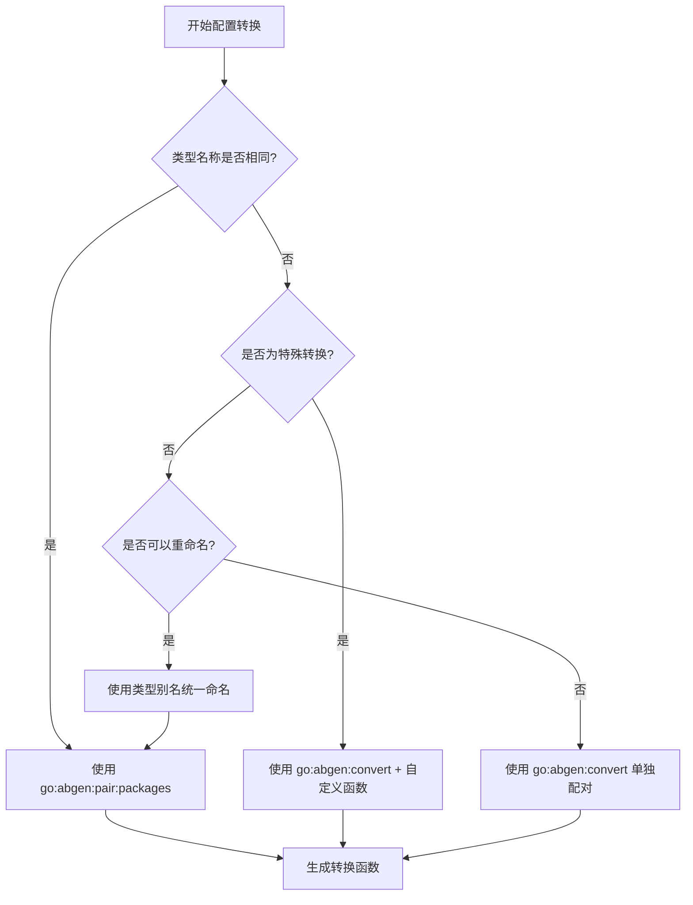

# ABGEN 规则定义文档 - DDD 开发指南

## 概述

本文档详细定义了 `abgen` 工具的规则体系，为领域驱动设计（DDD）开发提供完整的代码生成解决方案。通过明确的规则定义，开发者可以在不同层次间建立自动化的类型转换机制，确保 DDD 架构中各层之间的无缝集成。

---

## 1. 核心概念

### 1.1 指令 (Directives)

**定义**：以 `//go:abgen:` 开头的特殊注释，用于引导 `abgen` 代码生成行为。

**特点**：
- 文本形式的配置输入
- 可存在于 Go 源文件的任何位置
- 通常位于文件顶部（包级别）或特定类型声明上方

### 1.2 规则 (Rules)

**定义**：从指令中解析出的具体操作指令或配置项，是 `abgen` 运行时遵循的逻辑蓝图。

**核心特性**：
- **全局性**：所有规则汇集到全局集合
- **覆盖机制**：后解析的规则覆盖先解析的规则
- **作用对象**：作用于 Go 源代码中的实际 `type` 声明

---

## 2. 规则分类体系

### 2.1 包定义规则 (Package Definition Rules)

#### 规则意图
建立 Go 包到 `abgen` 内部别名的映射关系，简化后续指令中的包引用。

#### 规则语法
```go
//go:abgen:package:path=<完整包导入路径>[,alias=<别名>]
```

#### 参数说明
- `path`：Go 包的完整导入路径（必需）
- `alias`：在 `abgen` 内部使用的别名（可选）

#### 预期结果
- 建立 `<别名>` 到 `<完整包导入路径>` 的映射
- 后续指令可直接使用别名引用包
- 简化指令编写，提高可读性

#### DDD 应用场景
```go
// 实体层
//go:abgen:package:path=github.com/myapp/domain/entity,alias=entity
// 基础设施层
//go:abgen:package:path=github.com/myapp/infrastructure/persistence,alias=persistence
// 应用层
//go:abgen:package:path=github.com/myapp/application/dto,alias=dto
```

---

### 2.2 转换绑定规则 (Conversion Binding Rules)

#### 2.2.1 批量包配对

**规则意图**：在两个包之间自动建立所有同名类型的转换绑定。

**规则语法**：
```go
//go:abgen:pair:packages="<源包引用>,<目标包引用>"
```

**参数说明**：
- `<源包引用>`：可以是包别名（通过包定义规则定义）或完整包路径
- `<目标包引用>`：可以是包别名（通过包定义规则定义）或完整包路径

**支持的引用方式**：

1. **使用包别名**（推荐）：
   ```go
   // 先定义包别名
   //go:abgen:package:path=github.com/myapp/domain/entity,alias=entity
   //go:abgen:package:path=github.com/myapp/application/dto,alias=dto
   
   // 使用别名配对
   //go:abgen:pair:packages="entity,dto"
   ```

2. **使用完整包路径**：
   ```go
   // 直接使用完整路径配对
   //go:abgen:pair:packages="github.com/myapp/domain/entity,github.com/myapp/application/dto"
   ```

3. **混合使用**：
   ```go
   // 一个使用别名，一个使用完整路径
   //go:abgen:package:path=github.com/myapp/domain/entity,alias=entity
   //go:abgen:pair:packages="entity,github.com/myapp/application/dto"
   ```

**预期结果**：
- `abgen` 自动查找两个包中所有**名称相同的类型**
- 为每个同名类型建立转换绑定
- 生成对应的转换函数

**⚠️ 重要说明**：
- **匹配规则**：`go:abgen:pair:packages` 默认按照**类型名称完全相等**进行匹配
- **名称不匹配**：如果两个包中的类型名称不同，`pair:packages` 规则不会生效
- **解决方案**：对于名称不匹配的类型，必须使用 `go:abgen:convert` 单个指令进行配对

**最佳实践建议**：
- **推荐使用包别名**：提高可读性，便于维护
- **完整路径适用于**：一次性转换或临时场景
- **混合使用场景**：当部分包已定义别名，其他包需要直接引用时

**DDD 应用场景**：

#### 场景1：类型名称完全匹配（自动匹配）
```go
// entity 包中：type User struct {...}
// dto 包中：type User struct {...}

// 方式1：推荐使用别名
//go:abgen:package:path=github.com/myapp/domain/entity,alias=entity
//go:abgen:package:path=github.com/myapp/application/dto,alias=dto
//go:abgen:pair:packages="entity,dto"

// 方式2：直接使用完整路径
//go:abgen:pair:packages="github.com/myapp/domain/entity,github.com/myapp/application/dto"

// 方式3：混合使用
//go:abgen:package:path=github.com/myapp/domain/entity,alias=entity
//go:abgen:pair:packages="entity,github.com/myapp/application/dto"

// 所有方式都会生成：ConvertUserToUserDTO, ConvertOrderToOrderDTO 等
```

#### 场景2：类型名称不匹配（需要手动配对）
```go
// entity 包中：type User struct {...}
// dto 包中：type UserDTO struct {...}  // 注意：名称不同

// 这种情况下 pair:packages 不会生成 User -> UserDTO 的转换
//go:abgen:package:path=github.com/myapp/domain/entity,alias=entity
//go:abgen:package:path=github.com/myapp/application/dto,alias=dto
//go:abgen:pair:packages="entity,dto"  // 只能匹配同名类型，无法处理 User -> UserDTO

// 必须使用单个类型配对
//go:abgen:convert="User,UserDTO"  // 明确指定 User -> UserDTO 的转换
// 或者使用类型别名
type UserEntity = entity.User
//go:abgen:convert="UserEntity,UserDTO"
```

#### 场景3：混合匹配策略
```go
// 假设包中有以下类型：
// entity 包：User, Order, Product
// dto 包：UserDTO, Order, ProductDTO

// 使用组合策略
//go:abgen:package:path=github.com/myapp/domain/entity,alias=entity
//go:abgen:package:path=github.com/myapp/application/dto,alias=dto

// 1. 批量匹配同名类型（Order）
//go:abgen:pair:packages="entity,dto"  // 生成 ConvertOrderToOrder

// 2. 手动配对不同名的类型
//go:abgen:convert="User,UserDTO"      // 生成 ConvertUserToUserDTO
//go:abgen:convert="Product,ProductDTO" // 生成 ConvertProductToProductDTO
```

#### 2.2.2 单个类型配对

**规则意图**：明确指定两个特定类型之间的转换关系。

**规则语法**：
```go
//go:abgen:convert="source=<源包名或别名>,target=<目标包名或别名>,remap=<字段重映射规则>"
```

**参数说明**：
- `source`：源类型的完整引用（包名/别名.类型名）
- `target`：目标类型的完整引用（包名/别名.类型名）
- `remap`：可选的字段重映射规则，支持多个字段映射，用 `;` 分隔

**字段重映射规则格式**：
```
remap=<源字段路径>:<目标字段路径>;<源字段路径2>:<目标字段路径2>;...
```

**预期结果**：
- 为指定的两个类型建立转换绑定
- 生成对应的转换函数
- 支持跨包的特定类型转换
- 允许细粒度的字段映射控制

**DDD 应用场景**：
```go
// 基本类型配对
// 包别名定义
//go:abgen:package:path=github.com/project/entity,alias=ent
//go:abgen:package:path=github.com/project/dto,alias=resp
//go:abgen:package:path=github.com/project/persistence,alias=persist

//go:abgen:convert="source=ent.User,target=resp.UserDTO"

// 带字段重映射的类型配对
//go:abgen:convert="source=persist.UserModel,target=ent.User,remap=user_name:Name;profile_data:Profile"

// 多字段重映射
//go:abgen:convert="source=OrderModel,target=OrderDTO,remap=line_items:Items;customer_info:Customer;shipping_address:Address"
```

---

### 2.3 转换行为配置规则 (Conversion Behavior Configuration Rules)

#### 2.3.1 自定义函数规则

**规则意图**：为特定类型转换指定用户自定义的转换函数，处理复杂转换逻辑。

**规则语法**：
```go
//go:abgen:convert:rule="source:<源类型>,target:<目标类型>,func:<自定义函数名>"
```

**参数说明**：
- `source`：源类型
- `target`：目标类型
- `func`：自定义转换函数名

**预期结果**：
- 使用用户指定的函数进行类型转换
- 最高优先级规则，覆盖自动转换逻辑
- 支持任意复杂的转换场景

**DDD 应用场景**：
```go
// 包别名定义
//go:abgen:package:path=github.com/project/domain,alias=dom
//go:abgen:package:path=github.com/project/dto,alias=resp

// 复杂业务逻辑转换
//go:abgen:convert:rule="source:dom.Order,target:resp.OrderDTO,func:ConvertOrderWithBusinessLogic"

func ConvertOrderWithBusinessLogic(order *dom.Order) *resp.OrderDTO {
    dto := &resp.OrderDTO{
        ID: order.ID(),
        Total: order.CalculateTotal(), // 复杂业务计算
        Status: order.GetStatus().String(), // 枚举转换
        // ... 其他字段
    }
    return dto
}
```

#### 2.3.2 字段重映射规则

**规则意图**：在类型转换时，将源结构体的特定字段映射到目标结构体的不同字段路径。

**规则语法**：
```go
//go:abgen:convert:remap="<类型引用>#<源字段路径>:<目标字段路径>"
```

**参数说明**：
- `<类型引用>`：要应用规则的类型
- `<源字段路径>`：源结构体的字段路径（支持 `.` 访问嵌套字段）
- `<目标字段路径>`：目标结构体的字段路径

**预期结果**：
- 源字段的值赋给指定的目标字段
- 支持嵌套结构体的字段映射
- 覆盖默认的字段名匹配逻辑

**DDD 应用场景**：
```go
// 数据库模型到领域模型的重映射
type DBUser struct {
    ID       int64
    UserName string
    Profile  *DBProfile
}

type User struct {
    ID       int64
    Name     string
    Profile  *Profile
}

//go:abgen:convert:remap="DBUser#UserName:Name"
//go:abgen:convert:remap="DBUser#Profile.Bio:Profile.Description"
```

#### 2.3.3 字段控制规则

**规则意图**：在特定类型转换中忽略指定字段，防止敏感数据泄露或避免不必要的转换。

**规则语法**：
```go
//go:abgen:convert:ignore="<类型引用>#<字段名>[,<字段名2>...][;<类型引用2>#<字段名3>...]"
```

**参数说明**：
- `<类型引用>`：要应用规则的类型
- `<字段名>`：要忽略的字段名
- `,` 分隔同一类型的多个字段
- `;` 分隔不同类型的忽略规则

**预期结果**：
- 指定的字段在转换过程中被跳过
- 提高安全性（忽略敏感字段）
- 简化转换逻辑（排除冗余字段）

**DDD 应用场景**：
```go
// 安全性：忽略密码字段
//go:abgen:convert:ignore="UserEntity#Password,Salt"

// 性能优化：忽略大数据字段
//go:abgen:convert:ignore="UserEntity#Profile.LargeImage,Settings.BlobData"
```

#### 2.3.4 别名生成控制规则

**规则意图**：控制是否为转换中涉及的外部类型自动生成本地类型别名。

**规则语法**：
```go
//go:abgen:convert:alias:generate=<true|false>
```

**参数说明**：
- `true`：自动生成本地类型别名
- `false`：直接使用包名.类型名形式

**预期结果**：
- `true` 时：生成如 `type UserProto = pb.User` 的别名
- `false` 时：在代码中直接使用 `pb.User`（这是唯一例外情况）
- 影响代码的可读性和简洁性

**DDD 应用场景**：
```go
// 包别名定义
//go:abgen:package:path=github.com/project/dto,alias=resp

// 生成简洁的别名
//go:abgen:convert:alias:generate=true
// 生成：type UserDTO = resp.User

// 直接引用，保持明确性（例外情况）
//go:abgen:convert:alias:generate=false
// 使用：resp.User
```

#### 2.3.5 转换方向规则

**规则意图**：指定类型转换的方向，控制生成单向或双向转换函数。

**规则语法**：
```go
//go:abgen:convert:direction=<oneway|both>
```

**参数说明**：
- `oneway`：仅生成源到目标的转换
- `both`：生成双向转换函数（默认）

**预期结果**：
- `oneway`：只生成 `ConvertSourceToTarget`
- `both`：额外生成 `ConvertTargetToSource`

**DDD 应用场景**：
```go
// 实体到 DTO 只需单向转换（读取场景）
//go:abgen:convert:direction=oneway

// DTO 到实体需要双向转换（CQRS 场景）
//go:abgen:convert:direction=both
```

---

## 3. `go:abgen:pair:packages` 规则详细使用指南

### 3.1 规则灵活性与匹配机制

`go:abgen:pair:packages` 规则设计为高度灵活，但需要注意其核心匹配机制：

#### 3.1.1 核心匹配规则

**名称完全匹配原则**：
- `go:abgen:pair:packages` 默认按照**类型名称完全相等**进行匹配
- 只有当两个包中存在完全相同的类型名称时，才会生成转换函数
- 这是包级别自动转换的基础规则

**匹配示例**：
```go
// entity 包：type User struct {...}, type Order struct {...}
// dto 包：type User struct {...}, type Order struct {...}
// 结果：生成 ConvertUserToUser, ConvertOrderToOrder

// entity 包：type User struct {...}
// dto 包：type UserDTO struct {...}  
// 结果：不会生成 User -> UserDTO 转换（名称不匹配）
```

#### 3.1.2 三种引用方式

`go:abgen:pair:packages` 规则支持以下三种包引用方式：

#### 3.1.2 包别名引用（推荐）

**场景**：经常使用的包，需要多次引用

**优势**：
- 可读性强，配置简洁
- 便于维护和修改
- 减少重复输入

```go
// 预定义包别名
//go:abgen:package:path=github.com/myapp/domain/entity,alias=entity
//go:abgen:package:path=github.com/myapp/application/dto,alias=dto

// 使用别名配对
//go:abgen:pair:packages="entity,dto"
```

#### 3.1.3 完整包路径引用

**场景**：一次性转换、临时配对、避免定义过多别名

**优势**：
- 无需预定义，直接使用
- 适合快速原型和测试
- 减少别名管理复杂度

```go
// 直接使用完整路径
//go:abgen:pair:packages="github.com/myapp/domain/entity,github.com/myapp/application/dto"
//go:abgen:pair:packages="github.com/myapp/infrastructure/persistence,github.com/myapp/domain/entity"
```

#### 3.1.4 混合引用模式

**场景**：部分包频繁使用，其他包偶发性使用

**优势**：
- 平衡了可读性和灵活性
- 根据使用频率选择最优方案
- 避免预定义不必要的别名

```go
// 定义常用包别名
//go:abgen:package:path=github.com/myapp/domain/entity,alias=entity
//go:abgen:package:path=github.com/myapp/application/dto,alias=dto

// 混合使用：一个别名，一个完整路径
//go:abgen:pair:packages="entity,github.com/myapp/infrastructure/persistence"
//go:abgen:pair:packages="github.com/myapp/external/api,dto"
```

### 3.2 名称匹配策略与解决方案

#### 3.2.1 名称不匹配的常见场景

**场景1：命名约定差异**
```go
// 领域层：User, Order, Product
// 应用层：UserDTO, OrderDTO, ProductResponse

// 问题：名称不完全相同，pair:packages 无法自动匹配
//go:abgen:pair:packages="entity,dto" // 只会匹配 Order，不会匹配 User/Product
```

**场景2：架构分层命名**
```go
// 实体层：UserEntity, OrderEntity
// 持久化层：UserModel, OrderModel
// 基础设施层：UserDocument, OrderDocument

// 问题：不同层有不同的命名后缀，无法批量匹配
```

**场景3：第三方包集成**
```go
// 包别名定义
//go:abgen:package:path=github.com/project/pb,alias=pb
//go:abgen:package:path=github.com/project/v1,alias=v1

// 内部包：User, Order
// 第三方包：pb.User, v1.Order（使用别名）

// 问题：包名不同，类型名可能也不同
```

#### 3.2.2 解决方案策略

**策略1：混合使用 pair:packages 和 convert**
```go
// 批量匹配同名类型
//go:abgen:pair:packages="entity,dto" // 匹配所有同名的类型

// 单独配对不同名的类型
//go:abgen:convert="User,UserDTO"
//go:abgen:convert="Product,ProductResponse"
```

**策略2：使用类型别名统一名称**
```go
// 包别名定义
//go:abgen:package:path=github.com/project/entity,alias=ent
//go:abgen:package:path=github.com/project/dto,alias=resp

// 在配置文件中定义统一别名
type UserEntity = ent.User
type UserDTO = resp.UserDTO

// 使用别名进行配对
//go:abgen:convert="UserEntity,UserDTO"
//go:abgen:pair:packages="entity,dto" // 匹配其他同名类型
```

**策略3：命名约定标准化**
```go
// 建立项目级命名约定
// 领域层：User, Order, Product (无后缀)
// 应用层：UserDTO, OrderDTO, ProductDTO (统一DTO后缀)
// 基础设施层：UserModel, OrderModel, ProductModel (统一Model后缀)

// 这样可以更容易地识别和管理转换关系
```

#### 3.2.3 名称匹配决策流程



#### 3.2.4 实际项目示例

```go
// === 第一步：定义包别名 ===
//go:abgen:package:path=github.com/myapp/domain/entity,alias=entity
//go:abgen:package:path=github.com/myapp/application/dto,alias=dto
//go:abgen:package:path=github.com/myapp/infrastructure/persistence,alias=persistence

// === 第二步：批量匹配同名类型 ===
// entity 包: User, Order, Product
// dto 包: User, Order, Product  ← 同名，自动匹配
//go:abgen:pair:packages="entity,dto"
// 生成：ConvertUserToUser, ConvertOrderToOrder, ConvertProductToProduct

// === 第三步：单独配对不同名的类型 ===
// entity 包: Customer
// dto 包: CustomerDTO  ← 不同名，手动配对
//go:abgen:convert="Customer,CustomerDTO"

// === 第四步：处理复杂的命名差异 ===
// persistence 包: UserModel, OrderModel
// entity 包: User, Order  ← 名名不匹配，需要处理
//go:abgen:convert="UserModel,User"
//go:abgen:convert="OrderModel,Order"

// === 第五步：特殊情况处理 ===
// 使用自定义函数处理复杂转换
//go:abgen:convert:rule="source:User,target:UserDTO,func:ConvertUserWithBusinessLogic"
```

### 3.3 配置组织与管理

#### 3.3.1 选择策略

| 场景 | 推荐方式 | 原因 |
|------|----------|------|
| 核心业务层转换 | 包别名 | 使用频繁，需要高可读性 |
| 一次性数据迁移 | 完整路径 | 临时使用，避免预定义 |
| 微服务间转换 | 混合模式 | 核心服务用别名，外部服务用完整路径 |
| 测试和原型 | 完整路径 | 快速迭代，减少配置复杂度 |

#### 3.3.2 命名约定

```go
// 推荐的别名命名约定
//go:abgen:package:path=github.com/company/project/domain/entity,alias=entity
//go:abgen:package:path=github.com/company/project/domain/valueobject,alias=vo
//go:abgen:package:path=github.com/company/project/application/dto,alias=dto
//go:abgen:package:path=github.com/company/project/application/command,alias=cmd
//go:abgen:package:path=github.com/company/project/application/query,alias=query
//go:abgen:package:path=github.com/company/project/infrastructure/persistence,alias=persistence
//go:abgen:package:path=github.com/company/project/infrastructure/cache,alias=cache
//go:abgen:package:path=github.com/company/project/interfaces/grpc,alias=grpc
//go:abgen:package:path=github.com/company/project/interfaces/rest,alias=rest
```

#### 3.3.3 配置组织

```go
// === 阶段1：定义核心层别名 ===
//go:abgen:package:path=github.com/myapp/domain/entity,alias=entity
//go:abgen:package:path=github.com/myapp/domain/valueobject,alias=vo
//go:abgen:package:path=github.com/myapp/application/dto,alias=dto

// === 阶段2：核心层转换（使用别名） ===
//go:abgen:pair:packages="entity,dto"
//go:abgen:pair:packages="vo,dto"

// === 阶段3：基础设施层转换（混合模式） ===
//go:abgen:package:path=github.com/myapp/infrastructure/persistence,alias=persistence
//go:abgen:pair:packages="entity,persistence"
//go:abgen:pair:packages="persistence,github.com/myapp/infrastructure/cache"

// === 阶段4：外部服务转换（完整路径） ===
//go:abgen:pair:packages="dto,github.com/external-service/api/v1"
//go:abgen:pair:packages="github.com/another-service/models,entity"
```

### 3.4 性能和维护考虑

#### 3.4.1 性能影响

- **包别名**：轻微的初始化开销，但后续解析更快
- **完整路径**：无初始化开销，但每次都需要路径解析
- **实际差异**：在大多数应用中差异可忽略，选择应基于可读性和维护性

#### 3.4.2 维护建议

1. **定期审查**：定期检查未使用的包别名
2. **一致性**：在同一项目中保持使用模式的一致性
3. **文档化**：为复杂的包引用关系添加注释说明
4. **版本控制**：包路径变更时，集中更新相关的别名定义

---

## 4. 命名规则体系

### 4.1 Prefix/Suffix 规则详细说明

Prefix/Suffix 规则是全局性规则，会应用于所有相关的类型定义和函数生成。该规则通过 `source:suffix`、`source:prefix`、`target:suffix`、`target:prefix` 指令定义。

#### 4.1.1 规则应用范围

Prefix/Suffix 规则会自动应用到以下所有相关定义：

**1. 类型别名生成**
```go
// 规则定义
//go:abgen:convert:source:suffix=PB

// 生成的类型别名
type UserPB = source.User
type OrderPB = source.Order
type ProductPB = source.Product
```

**2. 转换函数命名**
```go
// 规则定义
//go:abgen:convert:source:suffix=PB
//go:abgen:convert:target:suffix=DTO

// 生成的转换函数
// 包别名定义
//go:abgen:package:path=github.com/project/source,alias=src
//go:abgen:package:path=github.com/project/dto,alias=resp

func ConvertUserPBToUserDTO(from *src.User) *resp.User
func ConvertOrderPBToOrderDTO(from *src.Order) *resp.Order
```

**3. 投影函数命名**
```go
// 规则定义
//go:abgen:convert:source:suffix=PB

// 包别名定义
//go:abgen:package:path=github.com/project/source,alias=src
//go:abgen:package:path=github.com/project/domain,alias=dom

// 对于字段 User.Permissions，生成的投影函数（使用别名）
func ConvertPermissionsPBToPermissionsEntity(from PermissionsPB) PermissionsEntity
```

**4. 集合类型别名**
```go
// 规则定义
//go:abgen:convert:source:suffix=PB

// 生成的数组/切片类型别名
type PermissionsPB = []*source.Permission
type RolesPB = []*source.Role
type ItemsPB = []*source.Item
```

#### 4.1.2 完整应用示例

```go
// === 配置规则 ===
//go:abgen:package:path=github.com/myapp/infrastructure/pb,alias=pb
//go:abgen:package:path=github.com/myapp/domain/entity,alias=entity
//go:abgen:convert:source:suffix=PB
//go:abgen:convert:target:suffix=Entity

// === 生成的代码 ===

// 包别名定义
//go:abgen:package:path=github.com/project/pb,alias=pb
//go:abgen:package:path=github.com/project/entity,alias=ent

// 1. 类型别名
type UserPB = pb.User
type OrderPB = pb.Order
type UserEntity = ent.User
type OrderEntity = ent.Order

// 2. 集合类型别名
type PermissionsPB = []*pb.Permission
type ItemsPB = []*pb.Item
type PermissionsEntity = []*ent.Permission
type ItemsEntity = []*ent.Item

// 3. 转换函数（正确使用别名参数）
func ConvertUserPBToUserEntity(from *UserPB) *UserEntity { ... }
func ConvertOrderPBToOrderEntity(from *OrderPB) *OrderEntity { ... }

// 4. 投影函数（基于字段，使用推测的类型别名）
func ConvertPermissionsPBToPermissionsEntity(from PermissionsPB) PermissionsEntity { ... }
func ConvertItemsPBToItemsEntity(from ItemsPB) ItemsEntity { ... }
```

#### 4.1.3 规则继承和覆盖

Prefix/Suffix 规则会递归应用到所有相关类型：

**继承规则**：
- 所有基于源类型生成的别名都会应用 source prefix/suffix
- 所有基于目标类型生成的别名都会应用 target prefix/suffix
- 投影函数会同时应用源和目标的规则

**示例**：
```go
// 规则定义
//go:abgen:convert:source:suffix=PB
//go:abgen:convert:target:suffix=DTO

// 对于 User -> UserDTO 转换：
// - 源类型别名：UserPB = pb.User
// - 目标类型别名：UserDTO = resp.User  
// - 转换函数：ConvertUserPBToUserDTO(from *UserPB) *UserDTO
// - 投影函数：ConvertRolesPBToRolesDTO(from []*RolesPB) []*RolesDTO（如果 User 有 Roles 字段）
```

### 4.2 方法推测规则

方法推测是 `abgen` 自动生成转换逻辑的核心机制，根据不同的类型匹配情况采用不同的策略：

#### 4.2.1 直接类型转换

**适用场景**：类型可以直接转换（基本类型兼容）

**转换策略**：直接在生成代码中进行类型转换

```go
// 示例：int32 -> int 转换
func ConvertUserPBToUserDTO(from *UserPB) *UserDTO {
    if from == nil {
        return nil
    }
    to := &UserDTO{
        ID:       from.Id,           // 直接赋值
        Age:      int(from.Age32),   // int32 -> int 直接转换
        Status:   from.Status,      // string -> string 直接赋值
        Active:   from.Active,      // bool -> bool 直接赋值
    }
    return to
}
```

**支持的直接转换**：
- 基本类型：`int32` ↔ `int`, `int64` ↔ `int`, `float32` ↔ `float64`
- 指针类型：`*T` ↔ `T`
- 接口类型：兼容接口间的转换
- 字符串类型：`string` ↔ 相关字符串类型

#### 4.2.2 已定义转换规则的数组转换

**适用场景**：字段类型是数组/切片，且元素类型已定义转换规则

**转换策略**：生成数组转换方法并调用

```go
// 假设已定义：func ConvertPermissionPBToPermissionEntity(*PermissionPB) *PermissionEntity

// 生成的数组转换方法（使用推测的类型别名）
func ConvertPermissionsPBToPermissionsEntity(from PermissionsPB) PermissionsEntity {
    if from == nil {
        return nil
    }
    to := make(PermissionsEntity, len(from))
    for i, item := range from {
        to[i] = ConvertPermissionPBToPermissionEntity(item)
    }
    return to
}

// 在主转换函数中调用
func ConvertUserPBToUserDTO(from *UserPB) *UserDTO {
    to := &UserDTO{
        ID:          from.Id,
        Permissions: ConvertPermissionsPBToPermissionsEntity(from.Permissions), // 调用数组转换方法
        Roles:       ConvertRolesPBToRolesEntity(from.Roles),                    // 调用数组转换方法
    }
    return to
}
```

#### 4.2.3 默认转换规则

**适用场景**：常用类型转换，如 UUID -> String

**转换策略**：使用内置的默认转换规则，不生成别名，直接使用包名+类型

```go
// 常用默认转换规则示例
func ConvertUUIDToString(uuid.UUID) string {
    return uuid.String()
}

func ConvertStringToUUID(s string) uuid.UUID {
    return uuid.MustParse(s)
}

func ConvertTimeToString(time.Time) string {
    return time.Format(time.RFC3339)
}

func ConvertStringToTime(s string) time.Time {
    t, _ := time.Parse(time.RFC3339, s)
    return t
}

// 在转换函数中直接使用，不生成别名
func ConvertUserPBToUserDTO(from *UserPB) *UserDTO {
    to := &UserDTO{
        ID:       from.Id,
        UUID:     ConvertUUIDToString(from.Uuid), // 直接调用，不使用别名
        CreateAt: ConvertStringToTime(from.CreateTime),
    }
    return to
}
```

**内置默认转换规则列表**：
- `uuid.UUID` ↔ `string`
- `time.Time` ↔ `string`
- `json.RawMessage` ↔ `string`
- `decimal.Decimal` ↔ `string`
- `big.Int` ↔ `string`

#### 4.2.4 Stub 函数生成

**适用场景**：当所有前面规则都无效时，生成占位符函数

**转换策略**：生成 Stub 函数，要求用户手动实现

```go
// 生成的 Stub 函数
// ConvertComplexProfilePBToComplexProfileEntity converts from *ComplexProfilePB to *ComplexProfileEntity.
// Please implement this function.
func ConvertComplexProfilePBToComplexProfileEntity(from *ComplexProfilePB) *ComplexProfileEntity {
    // TODO: Implement this custom conversion.
    panic("custom conversion not implemented: ConvertComplexProfilePBToComplexProfileEntity")
}

// 在转换函数中调用 Stub 函数
func ConvertUserPBToUserDTO(from *UserPB) *UserDTO {
    to := &UserDTO{
        ID:       from.Id,
        Profile:  ConvertComplexProfilePBToComplexProfileEntity(from.Profile), // 调用 Stub 函数
    }
    return to
}
```

#### 4.2.5 方法推测决策流程

```mermaid
flowchart TD
    A[类型转换需求] --> B{类型可直接转换?}
    B -->|是| C[直接转换: to.Field = T(from.Field)]
    B -->|否| D{是数组且元素有转换规则?}
    D -->|是| E[生成数组转换方法并调用]
    D -->|否| F{是常用类型有默认规则?}
    F -->|是| G[调用默认转换规则]
    F -->|否| H[生成Stub函数]
    C --> I[完成转换]
    E --> I
    G --> I
    H --> I
```

#### 4.2.6 完整转换示例

```go
// === 源类型 ===
type UserPB struct {
    Id          int32
    Name        string
    Age32       int32                    // 需要直接转换 int32 -> int
    Uuid        []byte                   // 需要默认转换 UUID -> String
    Permissions []*PermissionPB          // 需要数组转换
    Profile     *ComplexProfilePB        // 需要生成 Stub
}

// === 生成的转换函数 ===
func ConvertUserPBToUserEntity(from *UserPB) *UserEntity {
    if from == nil {
        return nil
    }
    to := &UserEntity{
        ID:          from.Id,
        Name:        from.Name,
        Age:         int(from.Age32),                              // 直接转换
        UUID:        ConvertUUIDToString(from.Uuid),               // 默认转换规则
        Permissions: ConvertPermissionsPBToPermissionsEntity(from.Permissions), // 数组转换
        Profile:     ConvertComplexProfilePBToComplexProfileEntity(from.Profile), // Stub 函数
    }
    return to
}

// === 自动生成的辅助函数 ===

// 数组转换方法（使用推测的类型别名）
func ConvertPermissionsPBToPermissionsEntity(from PermissionsPB) PermissionsEntity {
    if from == nil {
        return nil
    }
    to := make(PermissionsEntity, len(from))
    for i, item := range from {
        to[i] = ConvertPermissionPBToPermissionEntity(item)
    }
    return to
}

// Stub 函数
func ConvertComplexProfilePBToComplexProfileEntity(from *ComplexProfilePB) *ComplexProfileEntity {
    // TODO: Implement this custom conversion.
    panic("custom conversion not implemented: ConvertComplexProfilePBToComplexProfileEntity")
}
```

### 4.3 传统命名规则（兼容性）

为了向后兼容，仍然支持传统的函数命名规则：

| 转换类型 | 命名模式 | 示例 | 说明 |
|----------|----------|------|------|
| 结构体转换 | `Convert[源类型名]To[目标类型名]` | `ConvertUserPBToUserDTO` | 应用 prefix/suffix 后的命名 |
| 基本类型转换 | `Convert[字段类型]To[基本类型]` | `ConvertInt32ToInt` | 基本类型转换 |
| 集合投影 | `Convert[源元素][字段名]sTo[目标元素]s` | `ConvertPermissionsPBToPermissionsEntity` | 应用 prefix/suffix 的投影 |

**注意**：在新的 Prefix/Suffix 规则下，类型名会包含相应的前缀/后缀。

---

## 5. DDD 架构集成模式

### 4.1 层次转换模式

#### Domain Layer → Application Layer
```go
// 方式1：使用包别名（推荐）
//go:abgen:package:path=github.com/myapp/domain/entity,alias=entity
//go:abgen:package:path=github.com/myapp/application/dto,alias=dto
//go:abgen:pair:packages="entity,dto"

// 方式2：直接使用完整包路径
//go:abgen:pair:packages="github.com/myapp/domain/entity,github.com/myapp/application/dto"

// 方式3：混合使用
//go:abgen:package:path=github.com/myapp/domain/entity,alias=entity
//go:abgen:pair:packages="entity,github.com/myapp/application/dto"

// 通用配置
//go:abgen:convert:target:suffix="DTO"
//go:abgen:convert:ignore="Entity#Version,InternalState"
```

**意图**：将领域实体转换为应用层 DTO，排除内部状态信息。

#### Application Layer → Domain Layer
```go
// 使用别名方式
//go:abgen:package:path=github.com/myapp/application/command,alias=command
//go:abgen:package:path=github.com/myapp/domain/valueobject,alias=vo
//go:abgen:pair:packages="command,vo"

// 或者直接使用完整路径
//go:abgen:pair:packages="github.com/myapp/application/command,github.com/myapp/domain/valueobject"

// 单个类型转换
//go:abgen:convert="CreateUserCommand,User"
//go:abgen:convert:rule="source:CreateUserCommand,target:User,func:CommandToEntity"
```

**意图**：将应用命令转换为领域实体，使用自定义函数处理业务规则验证。

### 4.2 CQRS 模式支持

#### Command Model 转换
```go
// 方式1：使用包别名（推荐）
//go:abgen:package:path=github.com/myapp/application/command,alias=cmd
//go:abgen:package:path=github.com/myapp/domain/aggregates,alias=agg
//go:abgen:pair:packages="cmd,agg"

// 方式2：直接使用完整包路径
//go:abgen:pair:packages="github.com/myapp/application/command,github.com/myapp/domain/aggregates"

// 方式3：混合使用（例如只定义一个别名）
//go:abgen:package:path=github.com/myapp/application/command,alias=cmd
//go:abgen:pair:packages="cmd,github.com/myapp/domain/aggregates"

// 通用配置
//go:abgen:convert:direction=both
//go:abgen:convert:source:suffix="Cmd"
//go:abgen:convert:target:suffix="Aggregate"
```

**意图**：支持命令模型和聚合根之间的双向转换，适用于 CQRS 架构。

#### Query Model 投影
```go
// 方式1：使用包别名（推荐）
//go:abgen:package:path=github.com/myapp/domain/readmodel,alias=readmodel
//go:abgen:package:path=github.com/myapp/infrastructure/projection,alias=proj
//go:abgen:pair:packages="readmodel,proj"

// 方式2：直接使用完整包路径
//go:abgen:pair:packages="github.com/myapp/domain/readmodel,github.com/myapp/infrastructure/projection"

// 方式3：灵活混合使用
//go:abgen:package:path=github.com/myapp/domain/readmodel,alias=readmodel
//go:abgen:pair:packages="readmodel,github.com/myapp/infrastructure/projection"

// 通用配置
//go:abgen:convert:remap="ReadModel#Events:Projection.EventHistory"
//go:abgen:convert:ignore="ReadModel#UncommittedEvents"
```

**意图**：创建读模型投影，处理事件历史和状态转换。

---

## 6. 规则优先级系统

### 5.1 优先级层次

| 优先级 | 规则类型 | 说明 | 示例 |
|--------|----------|------|------|
| 1 | 自定义函数规则 (rule) | 最高优先级，完全自定义逻辑 | `//go:abgen:convert:rule="..."` |
| 2 | 字段重映射规则 (remap) | 中等优先级，覆盖字段映射 | `//go:abgen:convert:remap="..."` |
| 3 | 忽略字段规则 (ignore) | 中等优先级，排除特定字段 | `//go:abgen:convert:ignore="..."` |
| 4 | 全局命名规则 | 较低优先级，影响命名 | `//go:abgen:convert:source:suffix="..."` |
| 5 | 自动类型转换 | 最低优先级，默认转换 | 自动基本类型转换 |

### 5.2 覆盖机制

- **物理顺序覆盖**：同一优先级规则，后定义的覆盖先定义的
- **文件解析顺序**：按文件名字典序，同一文件内按行号顺序
- **全局规则集合**：所有规则汇集到全局集合，不区分原始位置

---

## 7. 自动转换提升机制

### 6.1 提升条件

1. **类型不匹配**：源字段类型 ≠ 目标字段类型
2. **可识别模式**：
   - 基本类型转换：`string` ↔ `int/int32/int64`
   - 枚举转换：`string` ↔ `枚举整数类型`
   - 指针转换：`*T` ↔ `T`
3. **无自定义规则**：没有用户定义的转换规则

### 6.2 无例外提升策略

**重要**：abgen 不存在"不会提升"的情况，所有无法自动处理的转换都会：

1. **自动生成函数桩**：在 `custom.gen.go` 中生成占位符函数
2. **保证编译通过**：生成包含 panic 实现的函数
3. **要求用户实现**：用户需要手动实现具体逻辑
4. **明确提示信息**：函数注释说明转换需求

### 6.3 DDD 特殊场景处理

#### 值对象转换
```go
// 包别名定义
//go:abgen:package:path=github.com/project/valueobjects,alias=vo

// 自动生成的函数桩（使用别名）
func ConvertStringToEmail(from string) *vo.Email {
    // TODO: 实现邮箱值对象验证逻辑
    panic("custom conversion not implemented: ConvertStringToEmail")
}
```

#### 聚合根状态转换
```go
// 包别名定义
//go:abgen:package:path=github.com/project/domain,alias=dom

// 字符串到枚举转换（使用别名）
func ConvertStringToStatus(from string) *dom.Status {
    switch from {
    case "active":
        return dom.StatusActive
    case "inactive":
        return dom.StatusInactive
    case "suspended":
        return dom.StatusSuspended
    default:
        return dom.StatusUnknown
    }
}
```

---

## 8. 完整 DDD 项目配置示例

### 7.1 项目结构
```
project/
├── domain/
│   ├── entity/
│   ├── valueobject/
│   └── aggregates/
├── application/
│   ├── dto/
│   ├── command/
│   └── query/
├── infrastructure/
│   ├── persistence/
│   └── external/
└── interfaces/
    └── api/
```

### 7.2 配置文件示例

#### `domain/converter/abgen_config.go`
```go
package converter

import (
    _ "github.com/myapp/domain/entity"
    _ "github.com/myapp/domain/valueobject"
    _ "github.com/myapp/application/dto"
    _ "github.com/myapp/application/command"
    _ "github.com/myapp/infrastructure/persistence"
)

// === 包定义规则 ===
//go:abgen:package:path=github.com/myapp/domain/entity,alias=entity
//go:abgen:package:path=github.com/myapp/domain/valueobject,alias=vo
//go:abgen:package:path=github.com/myapp/application/dto,alias=dto
//go:abgen:package:path=github.com/myapp/application/command,alias=cmd
//go:abgen:package:path=github.com/myapp/infrastructure/persistence,alias=persistence

// === 全局命名规则 ===
//go:abgen:convert:source:suffix="Entity"
//go:abgen:convert:target:suffix="DTO"

// === 实体到 DTO 批量转换 ===
// 方式1：使用已定义的包别名（推荐）
//go:abgen:pair:packages="entity,dto"

// 方式2：直接使用完整包路径
//go:abgen:pair:packages="github.com/myapp/domain/entity,github.com/myapp/application/dto"

// 方式3：混合使用（一个别名，一个完整路径）
//go:abgen:pair:packages="entity,github.com/myapp/application/dto"

// === 命令到实体转换 ===
// 使用别名配对
//go:abgen:pair:packages="cmd,entity"
// 或者使用完整路径
//go:abgen:pair:packages="github.com/myapp/application/command,github.com/myapp/domain/entity"
//go:abgen:convert:direction=both

// === 持久化模型到实体转换 ===
// 混合使用示例：只定义了一个别名，另一个使用完整路径
//go:abgen:pair:packages="persistence,github.com/myapp/domain/entity"
//go:abgen:convert:source:suffix="Model"

// === 特殊场景：直接使用完整路径而不预定义别名 ===
// 适用于一次性的转换需求，避免预定义过多别名
//go:abgen:pair:packages="github.com/myapp/infrastructure/cache,github.com/myapp/domain/entity"

// === 安全性规则 ===
//go:abgen:convert:ignore="UserEntity#Password,Salt,SecurityToken"
//go:abgen:convert:ignore="OrderEntity#PaymentInfo"

// === 自定义转换规则 ===
//go:abgen:convert:rule="source:CreateUserCommand,target:UserEntity,func:CreateUserCommandToEntity"
//go:abgen:convert:rule="source:UserEntity,target:UserDTO,func:UserEntityToDTOWithPermissions"

// === 字段重映射规则 ===
//go:abgen:convert:remap="UserModel#user_name:Name"
//go:abgen:convert:remap="UserModel#profile_data:Profile"
//go:abgen:convert:remap="OrderModel#line_items:Items"
```

### 7.3 生成的代码结构

#### `zz_generated.abgen.go`
```go
package converter

import (
    "github.com/myapp/domain/entity"
    "github.com/myapp/application/dto"
    "github.com/myapp/infrastructure/persistence"
)

// 包别名定义
//go:abgen:package:path=github.com/project/entity,alias=ent
//go:abgen:package:path=github.com/project/dto,alias=resp
//go:abgen:package:path=github.com/project/persistence,alias=persist

// 类型别名
type UserEntity = ent.User
type UserDTO = resp.User
type UserModel = persist.User

// 自动生成的转换函数
func ConvertUserEntityToUserDTO(from *UserEntity) *UserDTO {
    if from == nil {
        return nil
    }
    
    to := &UserDTO{
        ID:       from.ID,
        Name:     from.Name,
        Email:    ConvertStringToEmail(from.Email),
        // Password, Salt, SecurityToken 被忽略
    }
    
    // 自定义转换调用
    return UserEntityToDTOWithPermissions(from, to)
}

// 基本类型转换函数
func ConvertStatusToInt32(from string) int32 {
    switch from {
    case "active":
        return 1
    case "inactive":
        return 0
    default:
        return 0
    }
}
```

#### `custom.gen.go`
```go
package converter

// ConvertStringToEmail converts from string to *vo.Email.
// Please implement this function.
func ConvertStringToEmail(from string) *vo.Email {
    // TODO: Implement email validation logic
    panic("custom conversion not implemented: ConvertStringToEmail")
}

// CreateUserCommandToEntity converts from *cmd.CreateUserCommand to *ent.User.
// Please implement this function.
func CreateUserCommandToEntity(from *cmd.CreateUserCommand) *ent.User {
    // TODO: Implement command to entity conversion with business rules
    panic("custom conversion not implemented: CreateUserCommandToEntity")
}

// UserEntityToDTOWithPermissions converts from *ent.User to *resp.User with permissions.
func UserEntityToDTOWithPermissions(from *ent.User, to *resp.User) *resp.User {
    // TODO: Add permission information based on user roles
    return to
}
```

---

## 9. 最佳实践指南

### 8.1 配置组织原则

1. **集中配置**：将所有 `abgen` 指令集中在专门的配置文件中
2. **模块化分离**：按 DDD 分层组织不同的转换配置
3. **命名一致性**：建立清晰的命名约定并保持一致
4. **文档化**：为复杂的自定义转换添加详细注释

### 8.2 性能优化建议

1. **选择性转换**：使用 `ignore` 规则排除不必要字段
2. **批量处理**：利用批量包配对减少配置复杂度
3. **缓存策略**：对频繁转换的数据考虑缓存
4. **延迟加载**：对大型聚合采用延迟转换策略

### 8.3 安全性考虑

1. **敏感数据保护**：始终使用 `ignore` 规则排除密码、令牌等敏感字段
2. **数据验证**：在自定义转换函数中实现数据验证
3. **权限检查**：在 DTO 转换中集成权限控制逻辑
4. **审计日志**：为关键转换添加审计日志记录

### 8.4 测试策略

1. **单元测试**：为每个自定义转换函数编写单元测试
2. **集成测试**：测试完整的转换链路
3. **性能测试**：验证大规模数据转换的性能
4. **回归测试**：确保规则变更不会破坏现有功能

---

## 10. 故障排除指南

### 9.1 常见问题

#### 类型未定义错误
**症状**：`undefined: TypeName` 错误
**解决方案**：
- 检查包定义规则是否正确
- 验证类型引用路径是否完整
- 确保虚拟类型预测正常工作

#### 循环依赖
**症状**：转换函数之间的循环引用
**解决方案**：
- 使用接口打破循环依赖
- 采用延迟初始化策略
- 重新设计领域模型结构

#### 转换不生效
**症状**：字段没有被正确转换
**解决方案**：
- 检查规则优先级是否正确
- 验证字段路径是否准确
- 确认没有冲突的规则覆盖

### 9.2 调试技巧

1. **启用详细日志**：使用环境变量启用调试模式
2. **逐步验证**：从简单转换开始逐步增加复杂度
3. **规则分析**：查看规则解析和应用的详细过程
4. **生成文件检查**：验证生成的代码是否符合预期

---

## 11. 版本兼容性和迁移

### 10.1 版本策略

- **语义化版本**：遵循 SemVer 规范
- **向后兼容**：主版本内保持 API 兼容性
- **弃用通知**：提前通知功能变更

### 10.2 迁移路径

#### 从 v0.x 到 v1.x
1. **指令语法更新**：调整指令格式
2. **配置迁移**：更新配置结构
3. **测试验证**：验证迁移结果

#### 自动化迁移工具
- 配置检测工具
- 自动迁移脚本
- 结果验证工具

---

## 12. 总结

`abgen` 工具通过完整的规则体系为 DDD 开发提供了强大的代码生成支持：

### 12.1 核心价值

1. **自动化转换**：减少手动编写转换代码的工作量
2. **类型安全**：编译时确保类型转换的正确性
3. **架构一致性**：维护 DDD 分层间的清晰边界
4. **开发效率**：提高开发速度，降低维护成本

### 12.2 适用场景

- **企业级应用**：复杂的业务领域模型转换
- **微服务架构**：服务间的数据传输对象转换
- **CQRS 模式**：命令模型和查询模型的分离转换
- **事件驱动架构**：事件数据的序列化和反序列化

### 12.3 发展方向

1. **泛型支持**：完善对泛型类型的支持
2. **性能优化**：提升大规模数据转换的性能
3. **IDE 集成**：提供更好的 IDE 支持和工具集成
4. **生态扩展**：支持更多框架和库的集成

通过合理使用 `abgen` 规则体系，开发者可以构建出高质量、可维护的 DDD 应用系统，实现领域模型与技术架构的完美结合。